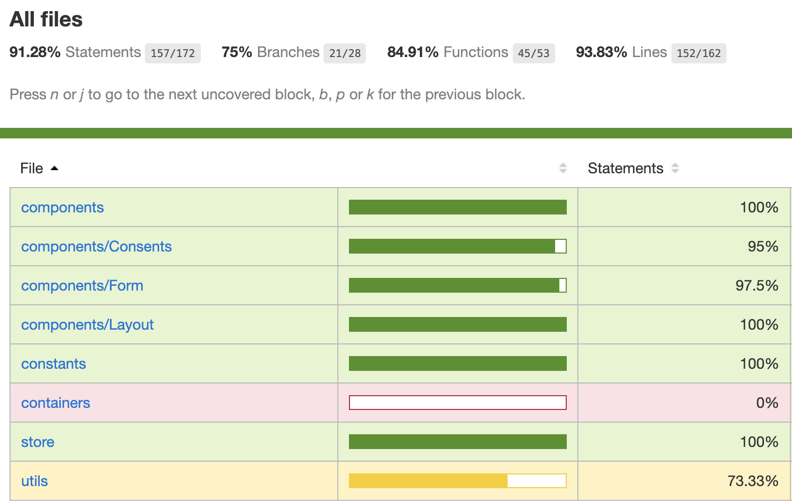

# Email preferences (technical task)

## The decision

### Demo
→→→→→→→→→→ 🔥 **<a href="https://didomi.vercel.app/" target="_blank">Demo</a>** 🔥 ←←←←←←←←←←

### Test Coverage

## The challenge

### Deliverables
The expected deliverable is a fully functional project that includes the following:

* Code of the application
* Tests of the application
* Documentation for launching a development environment and running the application

You are expected to match the mockups and use the right components as needed.

### Technical stack
The application should use one:

* React with Redux and a Material library

Except for these requirements, feel free to use whichever libraries, frameworks or tools you deem necessary.

### HTTP API calls
This challenge requires HTTP API calls when a user adds a consent or to populate the list of consents.

What we recommend is to implement the calls as standard HTTP requests to a REST API with the following specification:

- `GET /consents`: Returns a list of consents along with pagination data.
- `POST /consents`: Add a new consent.

You can then mock the HTTP calls by mocking the XMLHttpRequest object or the fetch method in the browser. The mock should have a pre-populated list of objects and add a new object to the list when a POST request is sent.

Other methods of mocking are also acceptable as long as there is no actual HTTP calls sent out.

### Product specification
The application is composed of two views.

#### 1. Consent collection form
A form that allows a user to enter her name, email address and to select data processes that she agrees to.

When the user fills out the form and clicks on the "Give consent" button, the consent gets added to the list of consents that appears on the second view.

#### 2. Consent management
A list of consents that were given by users. This view simply displays items from a list with client-side pagination.

